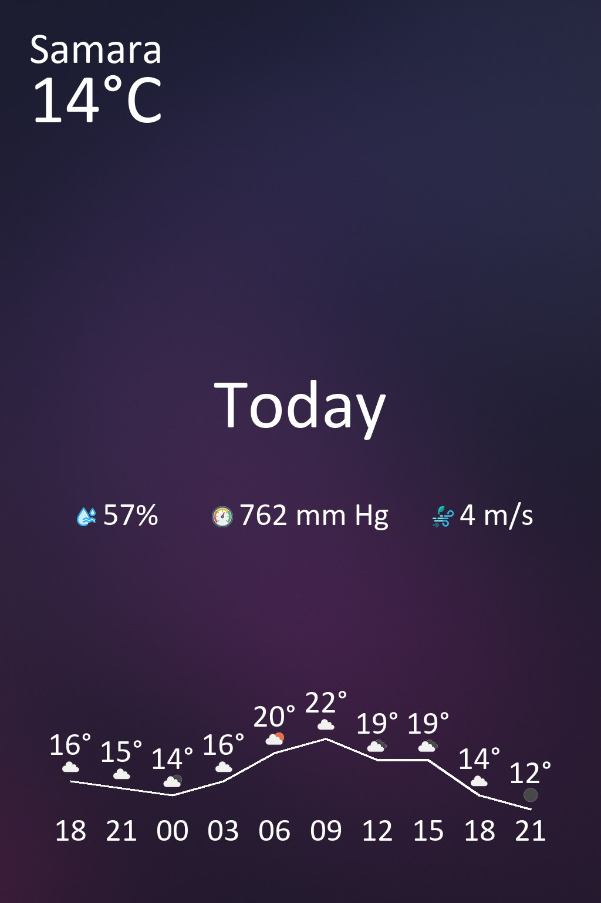

# ☁️Weatherly

This telegram bot sends weather forecasts as images in Telegram. It uses the OpenWeather API and sends forecasts upon request or daily at 7:00 AM

<p align="center">
  
</p>

## Features

- 🌤 Current weather image
- 📅 Daily and 5-day forecast images
- 🔔 Daily subscription with automatic notifications
- 🗺 Location-based weather
- Multilingual: English and Russian

## Demo

[👉 Launch Weatherly on Telegram](https://t.me/weather_useful_bot)

## Structure
```
weatherly/
│
├── images/
│   ├── backgrounds/      # Background images (e.g., background_*.png)
│   └── icons/            # Weather icons (e.g., wind_speed.png, pressure.png)
│
├── config.py             # Stores API tokens
├── request_list.py       # OpenWeatherMap API client
├── image_gen.py          # Image generation logic
├── bot.py                # Telegram bot handlers
├── main.py               # Entry point and scheduler config
└── subscriptions.json    # Auto-generated storage for subscribers
```


## Setup

1. Clone the repo
2. Install dependencies:
   ```bash
   pip install -r requirements.txt
   ```